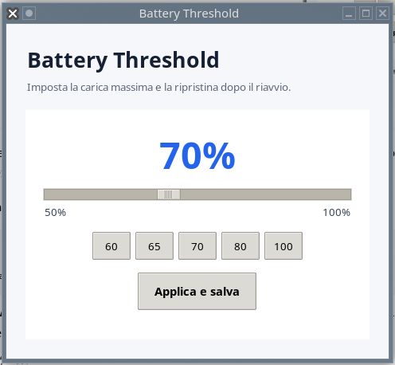

# Battery Threshold — Limite carica batteria

Battery Threshold è una piccola applicazione Linux indipendente dall’ambiente
grafico. Permette di impostare la percentuale massima di ricarica esposta dal
kernel tramite `charge_control_end_threshold`.



## Funzioni

- Valori rapidi 60, 65, 70, 80 e 100%
- Rilevamento automatico di `BAT0`, `BAT1` e batterie multiple
- Interfaccia italiana o inglese in base alla lingua del sistema
- Modifiche amministrative tramite Polkit
- Ripristino all’avvio con systemd, SysVinit e OpenRC
- Ripristino dopo sospensione sui sistemi systemd
- Pacchetti DEB, RPM e installatore portatile

## Requisiti

- Il computer deve esporre
  `/sys/class/power_supply/BAT*/charge_control_end_threshold`
- Python 3 con Tkinter
- Polkit con `pkexec`

Se il file del kernel non esiste, l’applicazione segnala che il computer non è
compatibile e disattiva il pulsante di applicazione.

## Installazione

Su iDeal Linux, Debian, Ubuntu, Mint e MX:

```bash
sudo apt install ./battery-threshold_0.1.0.beta1_all.deb
```

Su Fedora e derivate:

```bash
sudo dnf install ./battery-threshold-0.1.0-0.beta1.noarch.rpm
```

Su openSUSE sostituire `dnf install` con `zypper install`. Per Gentoo/OpenRC e
altri sistemi è disponibile l’installatore portatile.

## Avvertenza beta

La versione 0.1.0 è destinata ai test. Prima di dichiarare compatibile un nuovo
portatile, verificare che il valore scelto resti presente dopo un riavvio.

## Licenza e autore

Copyright © 2026 Marco Z.  
GNU General Public License v3.0 o successiva.

Repository del progetto: [EmmeGeen-lab/battery-threshold](https://github.com/EmmeGeen-lab/battery-threshold)
