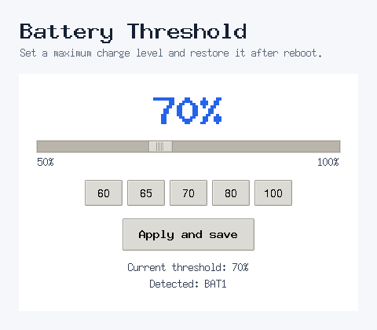

# Battery Threshold

Battery Threshold is a small, desktop-independent Linux application for setting
the maximum battery charge level exposed by the kernel through
`charge_control_end_threshold`.

It is designed for people who want one clear control without installing a full
power-management suite.



## Features

- Simple Tk interface with 60, 65, 70, 80 and 100% presets
- Automatic `BAT0`, `BAT1`, and multi-battery detection
- English and Italian interface, selected from the system locale
- Privileged changes through Polkit (`pkexec`)
- Persistent setting at boot
- systemd, SysVinit, and OpenRC support
- Reapply after systemd suspend/resume
- DEB, RPM, and portable installers

## Requirements

- Linux kernel and hardware driver exposing
  `/sys/class/power_supply/BAT*/charge_control_end_threshold`
- Python 3 with Tkinter
- Polkit with `pkexec`

Battery Threshold does not emulate unsupported firmware functionality. If the
kernel node is absent, the application disables its Apply button.

## Installation

### Debian, Ubuntu, Mint, MX, iDeal Linux

```bash
sudo apt install ./battery-threshold_0.1.0~beta1_all.deb
```

### Fedora, RHEL, Rocky, AlmaLinux, openSUSE

```bash
sudo dnf install ./battery-threshold-0.1.0-0.beta1.noarch.rpm
```

Use `zypper install` instead of `dnf install` on openSUSE.

### Portable installer

```bash
chmod +x install.sh uninstall.sh
./install.sh
```

The portable installer detects systemd, OpenRC, or Debian-style SysVinit and
supports `sudo`, `doas`, or direct root execution.

## Security model

The graphical process runs as the logged-in user. Only the small helper is
executed as root through Polkit. It accepts one integer from 50 to 100, validates
it again, writes only to matching kernel threshold nodes, and stores a validated
configuration value in `/etc/default/battery-threshold`.

See [SECURITY.md](SECURITY.md) for reporting security issues.

## Compatibility

Support depends on the laptop firmware and kernel driver, not only on the Linux
distribution. See [COMPATIBILITY.md](COMPATIBILITY.md).

## Contributing

Bug reports, hardware test results, translations, and code contributions are
welcome. See [CONTRIBUTING.md](CONTRIBUTING.md) or open an issue in the
[project repository](https://github.com/EmmeGeen-lab/battery-threshold/issues).

## License and author

Copyright © 2026 Marco Z.  
Licensed under the GNU General Public License v3.0 or later.

Italian documentation: [README.it.md](README.it.md)
